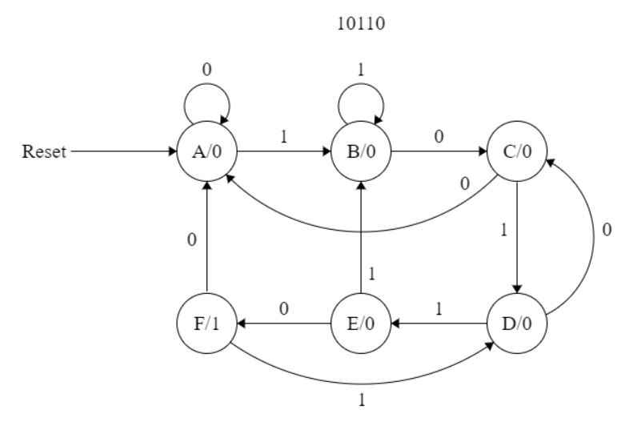

# sequenceFSM

This project is done in purpose of practicing on SystemVerilog verification.

The acheived goal was to detect the sequence 10110 through reading a stream of bits.

List of used SV features:
- SV Assertions.
- Test vector from a file.
- Enum for defining a state.

The most important files are:
- The design of the deector => sequenceFSM.sv
- The testbech for the design => sequenceFSM_tb.sv
- The test vector file => sequenceStream.txt

The coding is done using VSCode.

The simulator used is Questa Sim.

The following FSM was designed in order to detect the sequence:

